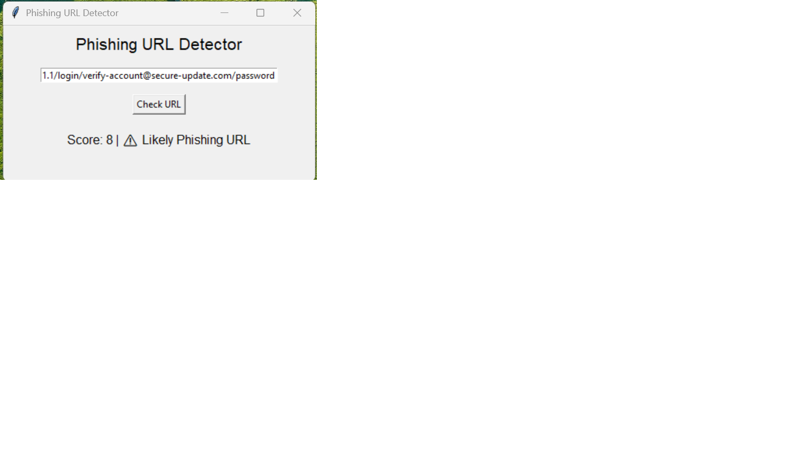

# Phishing URL Detector

A desktop GUI application that analyzes URLs and detects potential phishing attempts using heuristic scoring.

## What It Does

Paste any URL into the app and it checks for common phishing indicators, assigning a risk score based on multiple factors:

- **IP-based URLs** — Phishing sites often use raw IP addresses instead of domain names
- **Suspicious keywords** — Words like "login," "verify," "bank," and "password" in the URL
- **Excessive length** — Phishing URLs tend to be unusually long (75+ characters)
- **@ symbol in URL** — A classic trick to disguise the real destination
- **Excessive subdomains** — Multiple dots in the domain can indicate spoofing
- **Untrusted domains** — URLs not matching known trusted domains (Google, PayPal, Amazon, Microsoft)

The tool returns a score and a verdict: **Likely Safe**, **Suspicious**, or **Likely Phishing**.

## Screenshot



## How to Run

**Requirements:** Python 3.x (tkinter is included with Python by default)

```bash
git clone https://github.com/Fayez-Alba/phishing-url-detector.git
cd phishing-url-detector
python phishing-detector.py
```

No external libraries needed — the app uses only Python's built-in modules (`tkinter`, `re`, `urllib`).

## How the Scoring Works

| Check | Points |
|---|---|
| URL uses an IP address | +2 |
| Contains suspicious keywords | +2 |
| Contains @ symbol | +2 |
| URL length exceeds 75 characters | +1 |
| More than 2 subdomains | +1 |
| Domain not in trusted list | +1 |

- **Score 0–2:** Likely Safe
- **Score 3–4:** Suspicious
- **Score 5+:** Likely Phishing

## Limitations

This is a heuristic-based detector, not a production security tool. It doesn't check against real-time phishing databases, verify SSL certificates, or inspect page content. It's a learning project that demonstrates URL analysis techniques.

## Built With

- Python 3
- tkinter (GUI)
